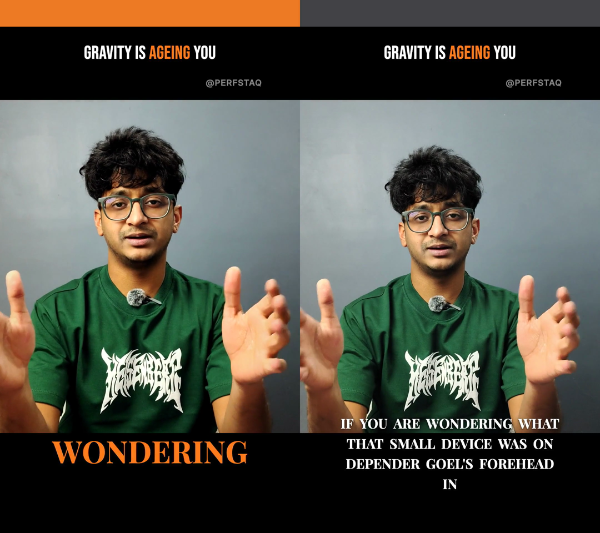
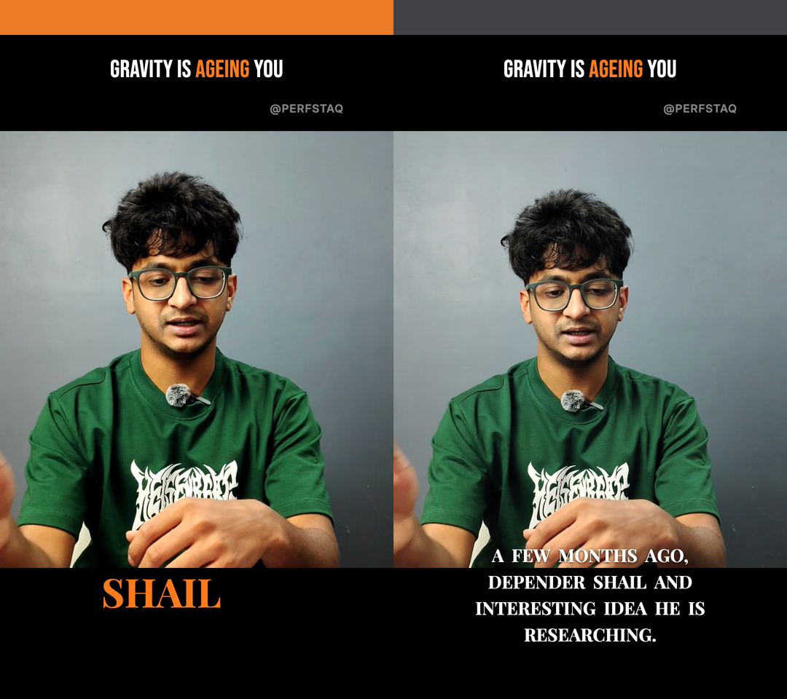
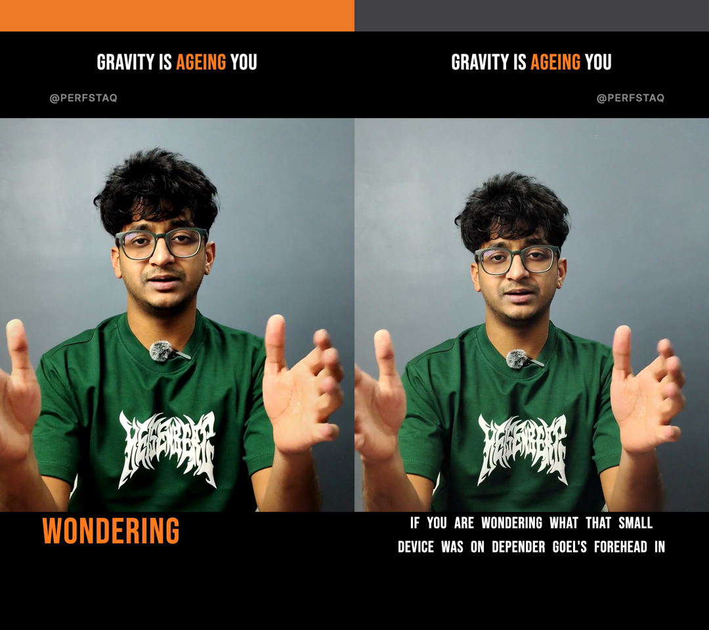
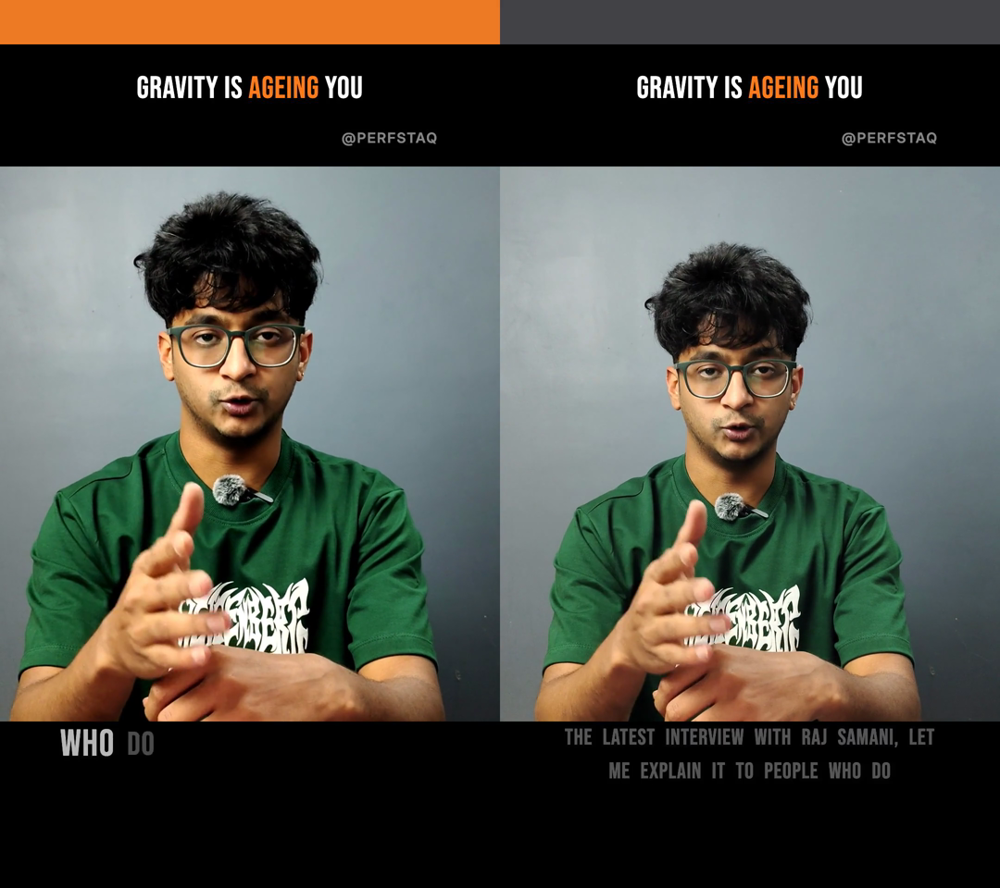
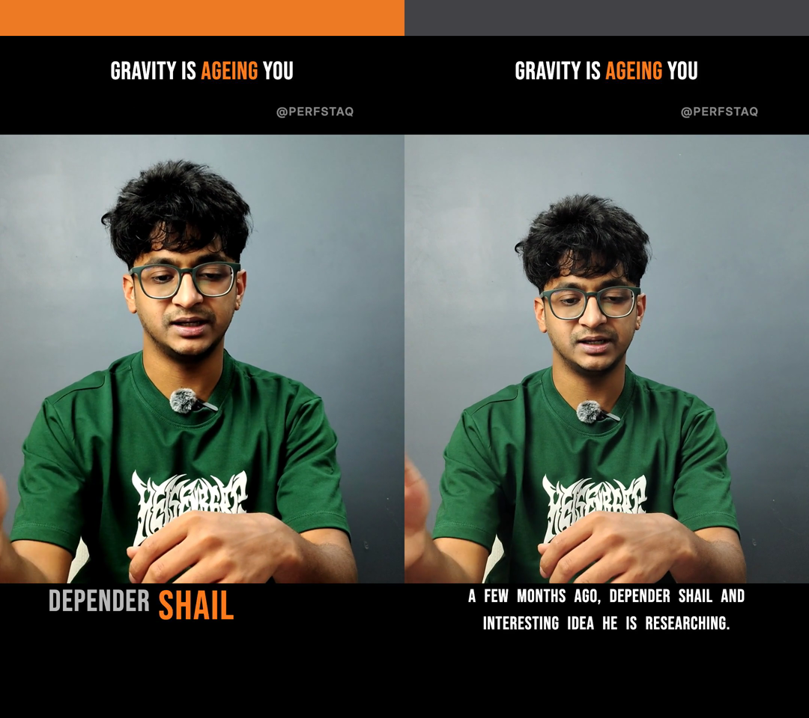
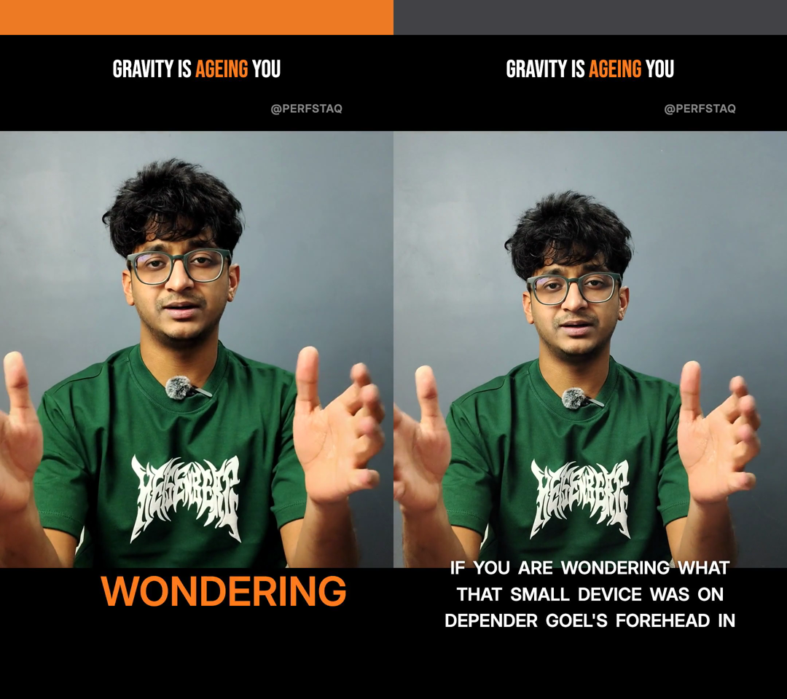
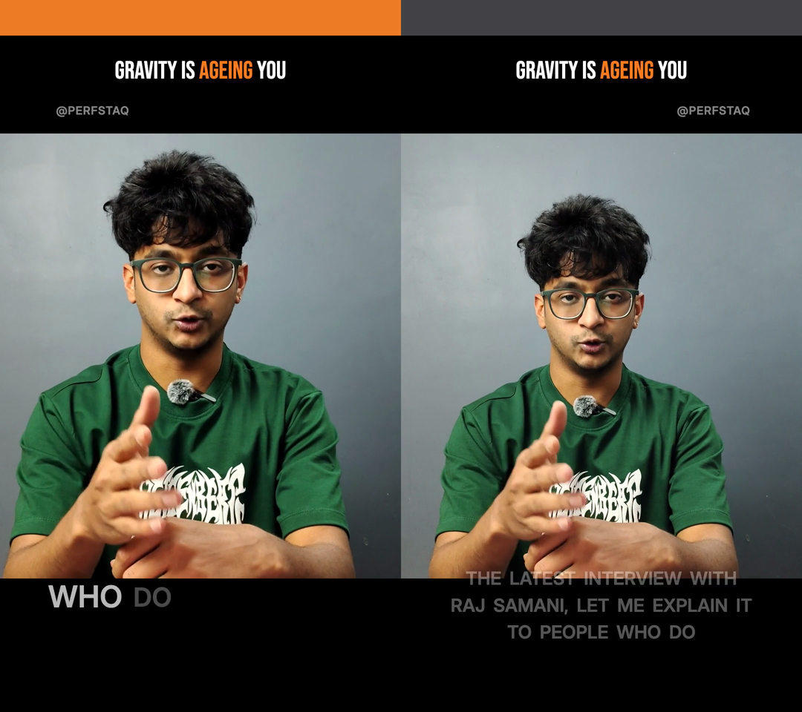
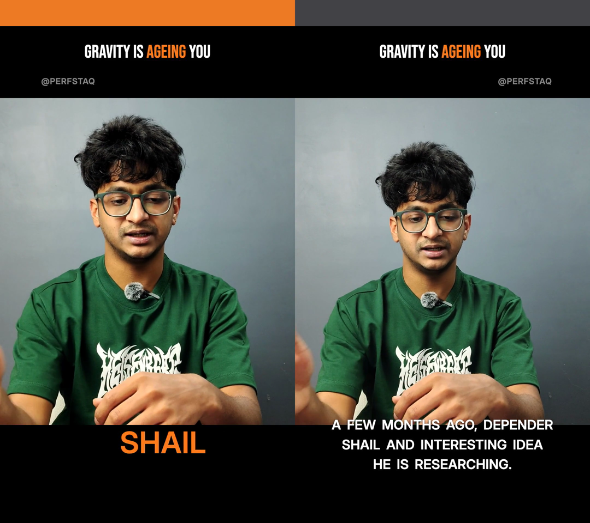

# W4.3 — PerfStaq against a naive baseline

Generated by `scripts/studio/build-comparison.ts`. **Do not hand-edit**: every
table and hash below is read back out of the artifacts the run produced, so the
prose cannot drift from the measurements.

- **Rendered from commit** `166ba67f385198fb7ec30ab76abfd5ed0b1f928a` — docs(studio): generate the comparison README from the artifacts, not by hand
- **Render-affecting tree dirty at render time:** no
- **Source** `/Users/sathvik/aix/studio-assets/talking-head-v1-1080.mp4`, sha256 `dd17a3609eca17ea613babf9c32f4892cc213e0edc20bf26fb38c719185af7b6`
- **ContentBrief** `cca7adf4-2404-455c-90ae-e907587f6284` — approved through the real gate in W4.1 and **reused, never regenerated** (invariant 1)
- **Hook** "GRAVITY IS AGEING YOU", emphasis word "AGEING"

## What is being compared

Both arms get the same footage, the same analysis, the same approved
ContentBrief and the same typography. The only variable is the motion system.

| | PerfStaq | baseline (`--baseline`) |
|---|---|---|
| cuts | beat-locked DP over word-edge candidates | fixed every 2.5s, beat-blind and word-blind |
| captions | ≤3 words, karaoke reveal per word onset, position rotates per shot, one scored emphasis word | whole sentences, static bottom-centre, no karaoke, no per-word timing, no emphasis |
| easing | `spring()` only; exits ~40% faster than entrances | `interpolate()` only, linear, symmetric in and out |
| camera | push/pull micro-motion on every shot + emphasis punch | none; `fromScale === toScale` |
| grade | per-template contrast/saturation/warm/vignette | identity |
| handle | alternates corners across shots | pinned in one corner |

The baseline lives in `packages/render/src/baseline/` and is fenced off from
every production path — see `apps/api/tests/studio-baseline.test.ts`, which
fails on any reference to it outside the two entry points.

## Verdict

**All three templates PASS on the real arm and FAIL on the baseline**, with the
same 12 hard gates scored and G1b excluded by derivation on both sides (neither
arm removes footage, so there is nothing for the scene detector to find —
§12.3, §12.37).

### statement_serif

| gate | PerfStaq | baseline | target |
|---|---|---|---|
| G1a Beat lock — musical intent | 100% (26/26) · PASS | 87% (20/23) · PASS | ≥85% within 150ms of the embedded grid, AND (for beat_track grids) grid_quality present and ≥ 80% of the reference's 2.2003 (guards a degraded/absent grid gaming the gate) |
| G1b Beat lock — render fidelity | n/a · – | n/a · – | ≥90% of the plan's cut times have a detected cut within ±2 frames (66ms) — scored only for plans that remove footage |
| G2 Cut density | 26.1 · PASS | 23.2 · **FAIL** | 25-40 cuts/minute |
| G3 Shot length (median) | 1.68 · PASS | 2.5 · **FAIL** | 1.0-2.0s |
| G4 Min shot length | 0.65 · PASS | 2.11 · PASS | ≥0.6s |
| G5 Caption density | 3 · PASS | 14 · **FAIL** | ≤3 words visible simultaneously |
| G6 Caption position variance | 3 · PASS | 1 · **FAIL** | ≥3 distinct positions |
| G7 Micro-motion | 0/27 static · PASS | 24/24 static · **FAIL** | 100% of shots have scale delta >1% |
| G8 Emphasis | 89 chunks, 0 bad · PASS | 14 chunks, 0 bad · PASS | ≤1 emphasis word per chunk (schema-enforced) and it must index a real word |
| G9 Safe margins | 0 violation(s) · PASS | 11 violation(s) · **FAIL** | 0 text blocks within 12% of the left/right/bottom edge; banner top exempt to 8% (ARCHITECTURE §12.7); 0 karaoke blocks whose top is above the face floor at 0.717 (ARCHITECTURE §12.19) |
| G10 Word integrity | 0 violation(s) · PASS | 42 violation(s) · **FAIL** | 0 cuts landing mid-word (source in/out points) |
| G11 Loudness | -13.9 · PASS | -13.9 · PASS | -14 ±1 LUFS integrated |
| G12 Output spec | 1080x1920 h264+aac · PASS | 1080x1920 h264+aac · PASS | 1080x1920, 30fps, h264+aac |
| G13 Reproducibility | recorded · – | recorded · – | same plan+footage ⇒ identical checksum |
| G14 Provenance | linked · PASS | linked · PASS | render links to claim_ids + framework_id |

**Verdict:** PerfStaq PASS (12 hard gates scored, 1 excluded) · baseline FAIL (12 hard gates scored, 1 excluded)


*statement_serif — 0.88s. PerfStaq left, baseline right.*


*statement_serif — 7.47s. PerfStaq left, baseline right.*


*statement_serif — 30.00s. PerfStaq left, baseline right.*

---

### staccato_condensed

| gate | PerfStaq | baseline | target |
|---|---|---|---|
| G1a Beat lock — musical intent | 100% (28/28) · PASS | 87% (20/23) · PASS | ≥85% within 150ms of the embedded grid, AND (for beat_track grids) grid_quality present and ≥ 80% of the reference's 2.2003 (guards a degraded/absent grid gaming the gate) |
| G1b Beat lock — render fidelity | n/a · – | n/a · – | ≥90% of the plan's cut times have a detected cut within ±2 frames (66ms) — scored only for plans that remove footage |
| G2 Cut density | 28.2 · PASS | 23.2 · **FAIL** | 25-40 cuts/minute |
| G3 Shot length (median) | 1.62 · PASS | 2.5 · **FAIL** | 1.0-2.0s |
| G4 Min shot length | 0.8 · PASS | 2.11 · PASS | ≥0.6s |
| G5 Caption density | 3 · PASS | 14 · **FAIL** | ≤3 words visible simultaneously |
| G6 Caption position variance | 3 · PASS | 1 · **FAIL** | ≥3 distinct positions |
| G7 Micro-motion | 0/29 static · PASS | 24/24 static · **FAIL** | 100% of shots have scale delta >1% |
| G8 Emphasis | 62 chunks, 0 bad · PASS | 14 chunks, 0 bad · PASS | ≤1 emphasis word per chunk (schema-enforced) and it must index a real word |
| G9 Safe margins | 0 violation(s) · PASS | 3 violation(s) · **FAIL** | 0 text blocks within 12% of the left/right/bottom edge; banner top exempt to 8% (ARCHITECTURE §12.7); 0 karaoke blocks whose top is above the face floor at 0.717 (ARCHITECTURE §12.19) |
| G10 Word integrity | 0 violation(s) · PASS | 42 violation(s) · **FAIL** | 0 cuts landing mid-word (source in/out points) |
| G11 Loudness | -13.9 · PASS | -13.9 · PASS | -14 ±1 LUFS integrated |
| G12 Output spec | 1080x1920 h264+aac · PASS | 1080x1920 h264+aac · PASS | 1080x1920, 30fps, h264+aac |
| G13 Reproducibility | recorded · – | recorded · – | same plan+footage ⇒ identical checksum |
| G14 Provenance | linked · PASS | linked · PASS | render links to claim_ids + framework_id |

**Verdict:** PerfStaq PASS (12 hard gates scored, 1 excluded) · baseline FAIL (12 hard gates scored, 1 excluded)


*staccato_condensed — 0.88s. PerfStaq left, baseline right.*


*staccato_condensed — 7.47s. PerfStaq left, baseline right.*


*staccato_condensed — 30.00s. PerfStaq left, baseline right.*

---

### editorial_sans

| gate | PerfStaq | baseline | target |
|---|---|---|---|
| G1a Beat lock — musical intent | 100% (30/30) · PASS | 87% (20/23) · PASS | ≥85% within 150ms of the embedded grid, AND (for beat_track grids) grid_quality present and ≥ 80% of the reference's 2.2003 (guards a degraded/absent grid gaming the gate) |
| G1b Beat lock — render fidelity | n/a · – | n/a · – | ≥90% of the plan's cut times have a detected cut within ±2 frames (66ms) — scored only for plans that remove footage |
| G2 Cut density | 30.2 · PASS | 23.2 · **FAIL** | 25-40 cuts/minute |
| G3 Shot length (median) | 1.38 · PASS | 2.5 · **FAIL** | 1.0-2.0s |
| G4 Min shot length | 0.81 · PASS | 2.11 · PASS | ≥0.6s |
| G5 Caption density | 3 · PASS | 14 · **FAIL** | ≤3 words visible simultaneously |
| G6 Caption position variance | 3 · PASS | 1 · **FAIL** | ≥3 distinct positions |
| G7 Micro-motion | 0/31 static · PASS | 24/24 static · **FAIL** | 100% of shots have scale delta >1% |
| G8 Emphasis | 89 chunks, 0 bad · PASS | 14 chunks, 0 bad · PASS | ≤1 emphasis word per chunk (schema-enforced) and it must index a real word |
| G9 Safe margins | 0 violation(s) · PASS | 11 violation(s) · **FAIL** | 0 text blocks within 12% of the left/right/bottom edge; banner top exempt to 8% (ARCHITECTURE §12.7); 0 karaoke blocks whose top is above the face floor at 0.717 (ARCHITECTURE §12.19) |
| G10 Word integrity | 0 violation(s) · PASS | 42 violation(s) · **FAIL** | 0 cuts landing mid-word (source in/out points) |
| G11 Loudness | -14 · PASS | -13.9 · PASS | -14 ±1 LUFS integrated |
| G12 Output spec | 1080x1920 h264+aac · PASS | 1080x1920 h264+aac · PASS | 1080x1920, 30fps, h264+aac |
| G13 Reproducibility | recorded · – | recorded · – | same plan+footage ⇒ identical checksum |
| G14 Provenance | linked · PASS | linked · PASS | render links to claim_ids + framework_id |

**Verdict:** PerfStaq PASS (12 hard gates scored, 1 excluded) · baseline FAIL (12 hard gates scored, 1 excluded)


*editorial_sans — 0.88s. PerfStaq left, baseline right.*


*editorial_sans — 7.47s. PerfStaq left, baseline right.*


*editorial_sans — 30.00s. PerfStaq left, baseline right.*


## The two timestamps §12.45 flagged

§12.43 moved captions into the letterbox bars because two of them landed on the
subject's **hands** — at **7.47s** and **30.0s**. Both timestamps are sampled
above, on both arms.

- **7.47s** — PerfStaq: the caption sits wholly on black in the bottom bar,
  clear of the hands the subject is gesturing with. The ruling holds in the
  pixels, not just in the gate.
- **30.0s** — same. PerfStaq's caption is in the bar; the baseline's top line
  is across the forearms.

The naive arm reproduces the exact defect §12.43 was written to fix, which is
the most direct evidence available that the ruling was worth making: put
captions where a subtitle burner puts them, with no knowledge of the content
region, and they land on the subject.

## Defects found

**1. G1a does not discriminate the baseline on this fixture.** The beat grid is
143.6 BPM (median gap 418ms) and the naive 2.5s interval is 5.98 beats, so
beat-blind cuts land within 150ms of a beat **87% of the time** and clear
G1a's 85% gate — against ~69%, which is the fraction of the timeline the
±150ms windows cover. Every neighbouring interval fails (1.5s → 71.8%,
2.0s → 75.9%, 2.25s → 65.4%, 2.75s → 52.4%, 3.0s → 84.2%), so the pass is
arithmetic, not musicality. ADR-8 expects "≈100% because cuts are snapped
deliberately", and the real arm delivers exactly that (100% on all three) — but
§4.1's warning that "the gate is inside methodology noise" turns out to cut
this way too: **an 85% floor is reachable without consulting the grid at all.**
The interval was deliberately NOT retuned to make the baseline fail; tuning the
control arm to lose is the same error as softening it. Pinned in
`studio-baseline.test.ts`.

**2. G8 cannot see a reel with no emphasis at all.** The gate reads "≤1 emphasis
word per chunk, and it must index a real word". The baseline marks *zero*
emphasis words and scores clean on all three templates. This is §12.43's
stopword finding one step further out: G8 is mechanically satisfied while
saying nothing about whether any editorial emphasis happened.

**3. The emphasis scorer ignores the ASR confidence sitting next to the RMS it
does read.** On the real arm at **30.0s** the single accent word is
"**SHAIL**" — a mis-transcription of "shared", at faster-whisper confidence
**0.571** against a transcript median of **0.970**. Worse, "**what**" at
confidence **0.0423** — the least-confident token in the whole file — is also
selected as an emphasis word. §11.1 R1 had the sidecar add per-word `rms` for
exactly this scorer; `score` is in the same payload, unused. The most
prominent word on screen can therefore be a word the speaker did not say. This
is a motion-system defect, not a script one (§12.44): the *selection rule* is
ours.

**4. (Fixed during this workstream, recorded because it is §12.45's shape a
third time.)** The baseline's G9 numbers initially described a layout it never
drew — the composition computed its caption size from a module constant while
the plan still carried the template's 0.075·W display size, so G9 predicted a
six-line 510px block where the renderer drew three lines. Caught by a frame,
not by a gate; every check agreed with every other check and all were wrong
together. The size now lives on the plan and the block lays out with the same
0.02·W word gap `wrapWords` measures, so the prediction is exact. Note that
the choice changes the magnitude and not the verdict: at a natural ~12px space
the same sentence sets in three lines, whose block still runs to 0.8899 —
past G9's 0.88 bottom bound and still straddling the content-region edge.

## Determinism, measured

Re-rendering all three real arms from the plans committed in W4.1, in a
different output directory and a later session, reproduced the W4.1 manifest's
checksums **byte for byte**. That is §11.3's amended G13 — "paired re-render on
the identical pinned path ⇒ identical checksum" — actually satisfied rather
than recorded.

## What is committed, and what is not

Per §12.10 the MP4s stay out of git and their sha256 is recorded here:

| file | size | sha256 |
|---|---|---|
| `statement_serif-perfstaq.mp4` | 68.8 MB | `feb7f65b6464b6a6147a1990d568f00a0e086f192af0c69d7d5b7fc2771b169a` |
| `statement_serif-baseline.mp4` | 65.5 MB | `ae6844e2743c76e7f8b6d6c96954e5e2f3027e516f9d390245b545ee20c47e13` |
| `statement_serif-grid.mp4` | 51.3 MB | `e4a44ad66fc435d4e70a10c5eae2854267f032ca1f68951bae5e4cf1675a6ae9` |
| `staccato_condensed-perfstaq.mp4` | 68.3 MB | `75a24509fb2454265928dbe60227c1652e3210022c1df1d47f2edc49d0a758bc` |
| `staccato_condensed-baseline.mp4` | 65.0 MB | `37e65b2e359fcd79bdb98ebdeb9cdc218709ccd744a3351aca890a5b414bd258` |
| `staccato_condensed-grid.mp4` | 51.0 MB | `327aedba9c07af627eba1cf1b7203627e953afe604e1323e91dadd2d25921109` |
| `editorial_sans-perfstaq.mp4` | 68.0 MB | `4b7aa6411ebb8e2b2f248fba15464be42052d1e0c810770c137fabc82721b8d3` |
| `editorial_sans-baseline.mp4` | 65.5 MB | `17456dd0159717d243736dbb11a194b642d35ac3e4d2cb0d14482b59df28363b` |
| `editorial_sans-grid.mp4` | 51.0 MB | `f91651d29aff4cee51dde96753e4b4143c76ff5788d941b23da88fcc2807fb58` |
| `source-talking-head-v1-1080.mp4` (source) | 85.1 MB | `dd17a3609eca17ea613babf9c32f4892cc213e0edc20bf26fb38c719185af7b6` |

Committed: this README, `manifest.json`, every `qc-*.json`, every
`plan-*-baseline.json`, and the stacked PNG frames under `frames/`. The real
arm's plans are not duplicated here — they are already committed at
`docs/studio/evidence/<template>/plan.json` and are the files `--plan` was
given.

## Reading the grid renders

`<template>-grid.mp4` is 2160×1920: **PerfStaq left, baseline right**. This
machine's ffmpeg is built without libfreetype, so `drawtext` is unavailable and
the halves cannot be captioned. Each carries a 96px top band instead —
**0xFF7A1A (accent) = PerfStaq, 0x3A3A3E (grey) = baseline** — drawn with
`drawbox` into the letterbox bar above the banner, where it covers nothing.

## Reproducing

```
ANALYZER_PYTHON=/path/to/analyzer/.venv/bin/python \
  npx tsx scripts/studio/build-comparison.ts
```

One arm renders at a time and each MP4 is kept, because a render peaks at
~2.5GB of transient frame cache and two in flight is how the disk fills.
`--only <template>`, `--reuse-existing` (resume an interrupted run) and
`--skip-grid` (do not re-encode) are available.
